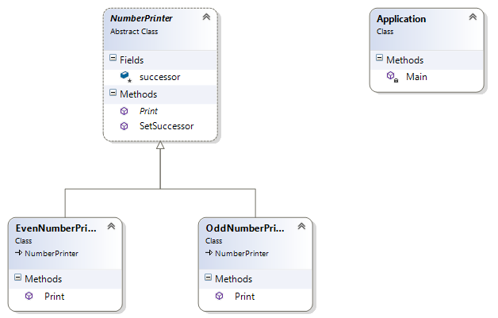

#Chain of responsibility
Реализира се, като се дава възможноът на повече от един обект да се справи с дадена задача. Задачата се подава на първия обект по веригата и се предава на следващ, докато се достигне до обект, който може да се справи със задачата.

## Диаграма

## Пример

В примера се разглеждаверига от два принтера. Единият принтер може да принтира четни числа, а другия нечетни. Числото се подава на четния принтер и ако е четно се принтира, а ако е нечетно се пренасочва към следващия принтер по веригата.

###UML

**The 'Handler' abstract class**
	
	public abstract class NumberPrinter
    {
        protected NumberPrinter successor;

        public void SetSuccessor(NumberPrinter successor)
        {
            this.successor = successor;
        }

        public abstract void Print(int number);
    }

**'ConcreteHandler' class**

    public class EvenNumberPrinter : NumberPrinter
    {
        public override void Print(int number)
        {
            if (number % 2 != 0 && this.successor != null)
            {
                successor.Print(number);
            }
            else
            {
                System.Console.WriteLine("The number " + number + " is even.");
            }
        }
    }

**'ConcreteHandler' class**

    public class OddNumberPrinter : NumberPrinter
    {
        public override void Print(int number)
        {
            Console.WriteLine("The number " + number + " is odd.");
        }
    }

**Application class**

	class Application
    {
        static void Main()
        {
            // Set the chain
            var evenNumberPrinter = new EvenNumberPrinter();
            var oddNumberPrinter = new OddNumberPrinter();
            evenNumberPrinter.SetSuccessor(oddNumberPrinter);

            for (int i = 0; i < 10; i++)
            {
                evenNumberPrinter.Print(i);
            }
        }
    }

	
